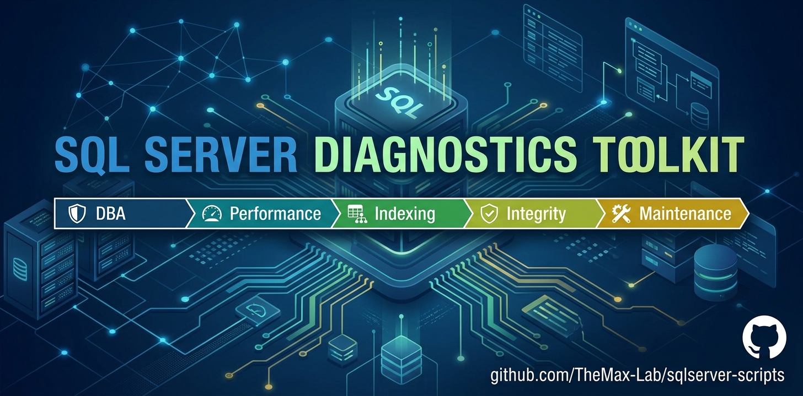

# SQL Server Scripts for DBAs

<p align="center">
  
</p>

<p align="center">
  <a href="https://www.microsoft.com/sql-server"></a>
  <a href="LICENSE"></a>
  
  <a href="https://github.com/TheMax-Lab/sqlserver-scripts/stargazers"></a>

  <a href="https://github.com/TheMax-Lab/sqlserver-scripts/releases/tag/v0.1.0">
    
  </a>
  <a href="https://github.com/TheMax-Lab/sqlserver-scripts">
    
  </a>
  <a href="https://github.com/TheMax-Lab/sqlserver-scripts/blob/main/LICENSE">
    
  </a>
  <a href="https://paypal.me/TheMaxLab">
    
  </a>
</p>

---

## 🚀 SQL Server Diagnostics — Desktop Tool

This project is more than a collection of SQL scripts.

The **SQL Server Diagnostics** desktop application brings together a curated set of SQL Server diagnostic checks into a single tool, helping you inspect database health, configuration, performance and potential issues without manually executing individual scripts.

### 🔎 Analyze your SQL Server environment

The current release includes:

- **26 manifest-driven SQL Server diagnostic checks**
- Health Check assessments
- Findings and diagnostic execution status
- Performance and query diagnostics
- Index analysis
- Database health checks
- Blocking and wait analysis
- Memory and TempDB diagnostics
- Foreign Key and integrity checks
- Schema analysis
- HTML report export
- JSON report export
- Findings CSV export
- Diagnostics CSV export
- Windows Authentication
- SQL Server Authentication
- Saved connection profiles
- Optional remembered SQL credentials protected using Windows DPAPI

The application is designed around an **evidence-first** approach:

> **Find the issue → understand the evidence → validate the recommendation → make an informed change.**

### 📥 Download SQL Server Diagnostics

**Latest release:**

👉 [**SQL Server Diagnostics v0.1.0**](https://github.com/TheMax-Lab/sqlserver-scripts/releases/tag/v0.1.0)

The current release is distributed as a **portable Windows x64 application**.

No installer and no database-side deployment are required.

After extracting the ZIP, run:

&&&
SqlServerDiagnostics.exe
&&&

### 🖥️ Current compatibility

The `v0.1.0` release has been live-validated against:

- SQL Server 2019 Express LocalDB
- Engine version `15.0.4382.1`
- Compatibility level `150`

This validation does not certify every SQL Server version, edition, configuration, Azure SQL Database or Azure SQL Managed Instance.

Additional environments will be progressively validated.

---

## ❤️ Support the Project

If these scripts or the SQL Server Diagnostics tool are useful to you, consider supporting the project.

This project is developed and maintained as an open-source initiative. Contributions help support:

- New diagnostic checks
- Improvements to the analysis engine
- Better reports and visualization
- Compatibility testing
- Documentation
- Bug fixes
- New features for the desktop tool

### ☕ Support via PayPal

<p align="center">
  <a href="https://paypal.me/TheMaxLab">
    
  </a>
</p>

<p align="center">
  <strong>Every contribution is appreciated and helps keep the project growing.</strong>
</p>

Support is completely voluntary and does not affect the availability or functionality of the software.

You can also support the project by:

- ⭐ Giving the repository a Star
- 🐛 Reporting issues
- 💡 Suggesting new diagnostics
- 🔧 Contributing improvements
- 📖 Improving documentation
- 📢 Sharing the project with other SQL Server professionals

---

# 📚 SQL Server Diagnostic Scripts

The repository contains a curated collection of **read-only SQL Server diagnostic scripts** for investigating:

- Database health
- Performance
- Query execution
- Blocking
- Wait statistics
- Memory pressure
- TempDB
- Indexes
- Query Store
- Backups
- Database capacity
- Statistics
- Fragmentation
- Referential integrity
- Schema design

---

A curated collection of **26 read-only SQL Server scripts for DBAs** covering database health checks, performance tuning, blocking, Query Store, indexes, TempDB, integrity, backups, statistics, capacity, and schema design.

Each script is standalone: open it in SQL Server Management Studio (SSMS), Azure Data Studio, or another T-SQL client, select the correct database context, and review the evidence. Scripts do not automatically change user databases. When corrective SQL is useful, it is returned as text for review.

> **Optional voluntary support: https://paypal.me/TheMaxLab**

> **Find the issue → understand the evidence → validate the recommendation → make an informed change.**

## Find the right SQL Server script

| DBA problem | Start with |
|---|---|
| SQL Server is slow and the cause is unknown | [`database_health.sql`](diagnostics/database_health.sql), [`wait_stats.sql`](diagnostics/wait_stats.sql) |
| Sessions are blocked | [`blocking_sessions.sql`](diagnostics/blocking_sessions.sql), [`open_transactions.sql`](diagnostics/open_transactions.sql) |
| A query is running too long | [`long_running_queries.sql`](diagnostics/long_running_queries.sql), [`expensive_queries.sql`](performance/expensive_queries.sql) |
| CPU usage is high | [`high_cpu_queries.sql`](performance/high_cpu_queries.sql), [`wait_stats.sql`](diagnostics/wait_stats.sql) |
| TempDB is under pressure | [`tempdb_usage.sql`](diagnostics/tempdb_usage.sql), [`memory_grants.sql`](performance/memory_grants.sql) |
| SQL Server has memory pressure | [`memory_pressure.sql`](diagnostics/memory_pressure.sql), [`memory_grants.sql`](performance/memory_grants.sql) |
| A query regressed | [`query_store_regressions.sql`](performance/query_store_regressions.sql), [`query_plan_candidates.sql`](performance/query_plan_candidates.sql) |
| Indexes need review | [`index_analysis.sql`](performance/index_analysis.sql), [`missing_indexes.sql`](performance/missing_indexes.sql) |
| Backups may be stale or missing | [`backup_health.sql`](maintenance/backup_health.sql) |
| Data or log files need capacity review | [`database_sizes.sql`](maintenance/database_sizes.sql), [`file_space.sql`](maintenance/file_space.sql) |
| Statistics or fragmentation need maintenance | [`statistics.sql`](maintenance/statistics.sql), [`fragmentation.sql`](maintenance/fragmentation.sql) |
| Referential integrity is uncertain | [`orphaned_records.sql`](integrity/orphaned_records.sql), [`untrusted_constraints.sql`](integrity/untrusted_constraints.sql) |
| Tables or data types need design review | [`missing_primary_keys.sql`](schema/missing_primary_keys.sql), [`heap_analysis.sql`](schema/heap_analysis.sql), [`schema_type_patterns.sql`](schema/schema_type_patterns.sql) |

## Quick start

```bash
git clone https://github.com/TheMax-Lab/sqlserver-scripts.git
cd sqlserver-scripts
```

1. Choose a script from the catalog below.
2. Read its header for scope, compatibility, permissions, cost, and risk.
3. Connect to a test or non-production environment first.
4. For database-scoped scripts, select the intended context:

   ```sql
   USE [YourDatabaseName];
   GO
   ```

5. Run the script and evaluate the returned evidence in workload context.
6. Review, test, and approve any generated SQL separately. Never execute recommendations blindly.

See the [compatibility and permissions guide](docs/COMPATIBILITY.md) before running scripts in production or Azure SQL.

## Complete script catalog

### Diagnostics

General SQL Server health, concurrency, memory, TempDB, and active-workload troubleshooting. [Category guide →](diagnostics/README.md)

| Script | Description |
|---|---|
| [`blocking_sessions.sql`](diagnostics/blocking_sessions.sql) | Shows blocked requests, direct blockers, waits, SQL text, and session context. |
| [`database_configuration.sql`](diagnostics/database_configuration.sql) | Reviews `AUTO_CLOSE`, `AUTO_SHRINK`, page verification, and automatic statistics options. |
| [`database_health.sql`](diagnostics/database_health.sql) | Provides a first-pass check of configuration, backup history, and transaction log health. |
| [`long_running_queries.sql`](diagnostics/long_running_queries.sql) | Finds active requests over the duration threshold with CPU, reads, waits, and SQL text. |
| [`memory_pressure.sql`](diagnostics/memory_pressure.sql) | Summarizes SQL Server/OS memory signals and the largest memory clerks. |
| [`open_transactions.sql`](diagnostics/open_transactions.sql) | Identifies old or sleeping open transactions, log use, blockers, and last SQL. |
| [`tempdb_usage.sql`](diagnostics/tempdb_usage.sql) | Reports TempDB utilization, file distribution, version store, and top consuming sessions. |
| [`wait_stats.sql`](diagnostics/wait_stats.sql) | Ranks meaningful cumulative instance waits and separates resource from signal wait time. |

### Performance

T-SQL performance tuning scripts for query cost, CPU, plans, memory grants, Query Store, and indexing. [Category guide →](performance/README.md)

| Script | Description |
|---|---|
| [`expensive_queries.sql`](performance/expensive_queries.sql) | Ranks cached queries by elapsed time, CPU, reads, and writes. |
| [`high_cpu_queries.sql`](performance/high_cpu_queries.sql) | Focuses on cached statements with high average or cumulative worker time. |
| [`index_analysis.sql`](performance/index_analysis.sql) | Correlates index usage, duplicate keys, size, and fragmentation. |
| [`memory_grants.sql`](performance/memory_grants.sql) | Finds waiting, large, and potentially underused active query memory grants. |
| [`missing_indexes.sql`](performance/missing_indexes.sql) | Ranks missing-index DMV candidates and returns reviewable `CREATE INDEX` text. |
| [`query_plan_candidates.sql`](performance/query_plan_candidates.sql) | Searches cached XML plans for implicit conversions, spills, and expensive scans. |
| [`query_store_regressions.sql`](performance/query_store_regressions.sql) | Compares recent Query Store duration with an earlier weighted baseline. |

### Integrity

Foreign-key support, trust, and orphan detection. [Category guide →](integrity/README.md)

| Script | Description |
|---|---|
| [`fk_analysis.sql`](integrity/fk_analysis.sql) | Finds unindexed, disabled, and untrusted foreign keys. |
| [`orphaned_records.sql`](integrity/orphaned_records.sql) | Scans foreign-key relationships for child rows without matching parents. |
| [`untrusted_constraints.sql`](integrity/untrusted_constraints.sql) | Reports disabled or untrusted foreign-key and check constraints. |

### Maintenance

Backup, capacity, fragmentation, and statistics diagnostics. [Category guide →](maintenance/README.md)

| Script | Description |
|---|---|
| [`backup_health.sql`](maintenance/backup_health.sql) | Reviews full, differential, and log backup recency from `msdb`. |
| [`database_sizes.sql`](maintenance/database_sizes.sql) | Reports file allocation, data-file free space, log use, maximum size, and growth. |
| [`file_space.sql`](maintenance/file_space.sql) | Highlights low data-file free space and questionable autogrowth settings. |
| [`fragmentation.sql`](maintenance/fragmentation.sql) | Finds fragmented rowstore indexes and generates maintenance candidates. |
| [`statistics.sql`](maintenance/statistics.sql) | Finds uninitialized or highly modified statistics and generates update commands. |

### Schema

Schema design and modernization checks. [Category guide →](schema/README.md)

| Script | Description |
|---|---|
| [`heap_analysis.sql`](schema/heap_analysis.sql) | Assesses heap size, forwarded records, page density, fragmentation, and indexes. |
| [`missing_primary_keys.sql`](schema/missing_primary_keys.sql) | Finds user tables without primary keys and supplies structural context. |
| [`schema_type_patterns.sql`](schema/schema_type_patterns.sql) | Flags missing keys, heaps, deprecated types, and `MAX` columns. |

## Scope and permissions at a glance

| Script type | Typical scope | Typical permission |
|---|---|---|
| Catalog and schema checks | Current database | Metadata visibility; sometimes `VIEW DATABASE STATE` |
| Database DMVs | Current database | `VIEW DATABASE STATE`; SQL Server 2022+ may use `VIEW DATABASE PERFORMANCE STATE` |
| Instance and plan-cache DMVs | SQL Server instance | `VIEW SERVER STATE`; SQL Server 2022+ may use `VIEW SERVER PERFORMANCE STATE` |
| Backup diagnostics | Instance and `msdb` | Read access to `sys.databases` and `msdb` backup history |
| Orphan detection | Current database and table data | `SELECT` on participating tables |

Permissions and Azure behavior vary by engine version, edition, database role, and service tier. See [`docs/COMPATIBILITY.md`](docs/COMPATIBILITY.md) and each script header.

## Safety model

- User database diagnostics are read-only by default.
- Suggested DDL or maintenance commands are returned as text, never automatically executed.
- Dynamic SQL in `orphaned_records.sql` performs `SELECT COUNT_BIG` scans only; it writes solely to a local temporary table.
- DMV values can be transient or incomplete after restarts, failovers, cache eviction, permission filtering, or Query Store cleanup.
- A recommendation is a candidate for investigation, not proof that a change is correct.
- Physical-statistics scans, XML plan inspection, Query Store aggregation, and orphan scans can be expensive on large systems.

## Repository structure

```text
sqlserver-scripts/
├── diagnostics/       # Health, blocking, waits, memory, TempDB
├── performance/       # Queries, plans, indexes, grants, Query Store
├── integrity/         # Foreign keys, trust, orphaned records
├── maintenance/       # Backups, files, fragmentation, statistics
├── schema/            # Keys, heaps, and data-type patterns
├── docs/              # Compatibility guide and contribution template
├── sqlserver-scripts.jpg
├── CONTRIBUTING.md
├── SECURITY.md
└── LICENSE
```

## Contributing

Contributions are welcome. Start with [`CONTRIBUTING.md`](CONTRIBUTING.md) and [`docs/SCRIPT_TEMPLATE.sql`](docs/SCRIPT_TEMPLATE.sql). New scripts should be narrowly scoped, read-only by default, documented in English, and added to both their category README and this catalog.

## SQL Server topics

`sql-server` · `sqlserver` · `t-sql` · `tsql` · `mssql` · `dba` · `database-administration` · `database-diagnostics` · `database-performance` · `performance-tuning` · `query-optimization` · `indexing` · `query-store` · `tempdb` · `database-maintenance` · `database-monitoring` · `database-troubleshooting` · `sql-scripts`

## License

Licensed under the [MIT License](LICENSE).

<p align="center"><strong>Actionable SQL Server diagnostics—evidence first, changes second.</strong></p>
